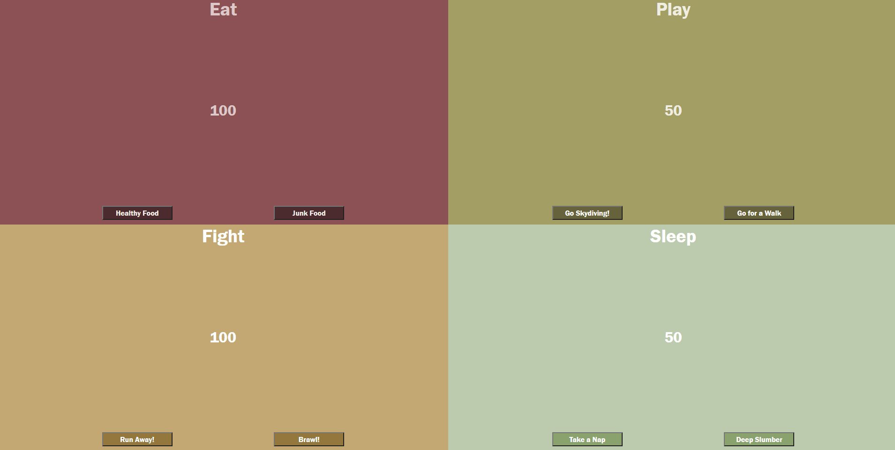

# Tamagotchi

Tamagotchi is a single-page website that lets the user take care of a virtual pet. The pet can be fed, played with, get into fights, and sleep.

## Details

Each button in each quadrant will increase or decrease the number in the corresponding quadrant on click. Each button has a predetermined number that it will increase or decrease. Each number cannot go higher than 100.

## Technologies Used

Webpack, JavaScript, SCSS/SASS, Modules, premade HTML (no HTML added except using JavaScript)

## Link

[Link to the application](https://bandstrar-tamagotchi.netlify.app/)